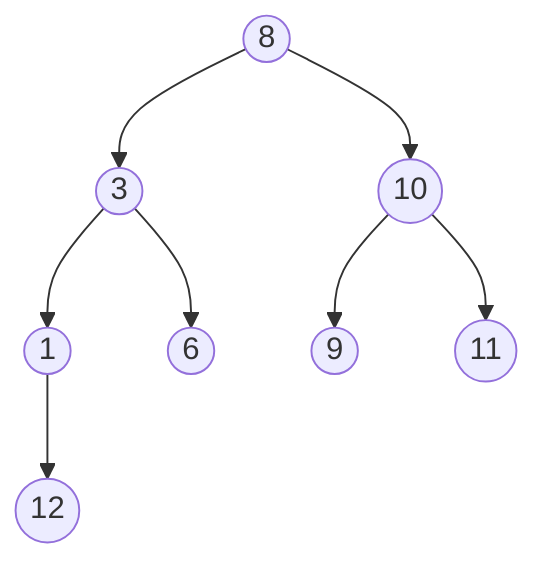
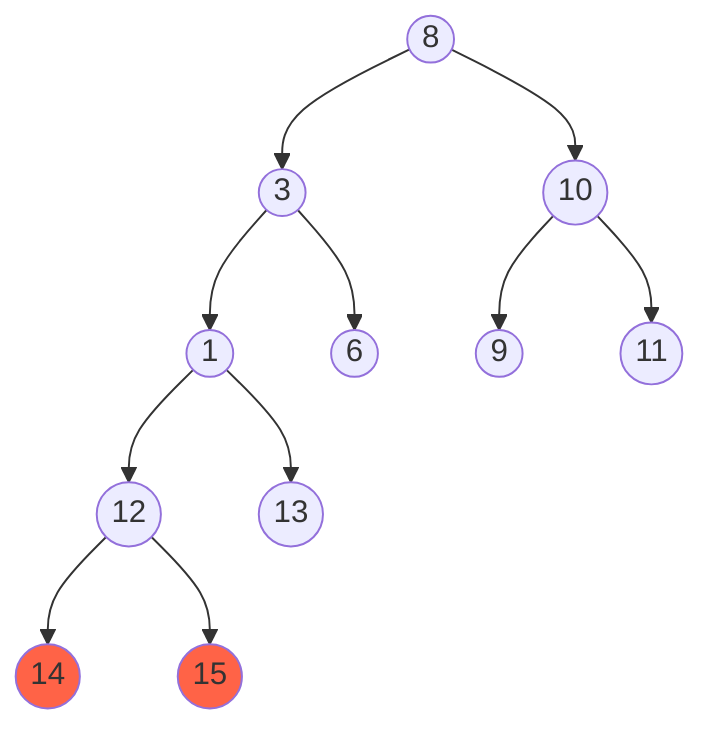
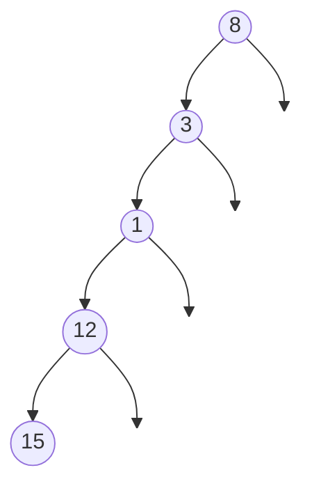

 A balanced [[binary tree]] is one in which no leaf nodes are ‘too far’ from the root. For example, one definition of balanced could require that all leaf nodes have a depth that differ by at most 1.

## Balanced Example
This [[tree]] is balanced. `12` is only different by a depth of 1.

## Unbalanced Example
This graph is unbalanced because `14` and `15` are two levels below `6`, `9`, and `11`.

In the really extreme case a tree can turn into essentially a linked list, when you only have one left child per level or only one right child per level. This one is as unbalanced as possible. It's sometimes a useful edge case to think about. 

## Self balancing binary trees
