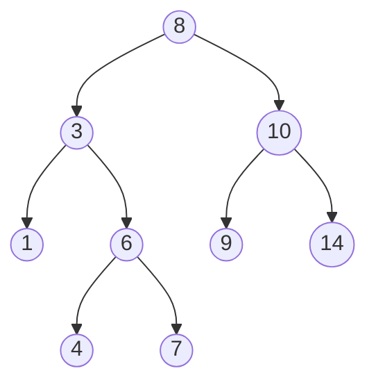
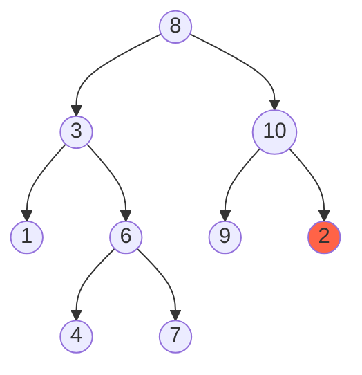

A binary search [[tree]] is a special type of [[binary-tree|binary tree]] where all nodes in the left subtree are less than the root and all nodes in the right subtree are greater than the root.

It is important because this organization allows us to find a value in O(log(n)) time.

## Binary Search Tree Diagram



## Non-Binary Search Tree Diagram
`2` is less than `10` but on the right hand side, which breaks the ordered rule of binary search trees.




Here's an example of a [[tree]] node
```js
class Node {
	constructor(data) {
		this.data = data;
		this.left = null;
		this.right = null;
	}
}
```

##  Insert Operation
The insert operation has an average time complexity of `O(log(n))` and a worst case of `O(n)` unless the tree is a [[balanced-binary-tree|balanced binary tree]], which has a worst case of `O(log(n))`


```js
	insert(data) {
		if (data < this.data) {
			if (this.left){
				this.left.insert(data);
			} else {
				this.left = new Node(data);
			}
		} else if (data > this.data) {
			if (this.right){
				this.right.insert(data);
			} else if (data > this.data) {
				this.right = new Node(data);
			}
		}
	}
}
```


## Find Operation
The find operation has an average time complexity of `O(log(n))` and a worst case of `O(n)` unless the tree is a [[balanced-binary-tree|balanced binary tree]], which has a worst case of `O(log(n))`
```js

  find(data) {
    if (this.data === data) {
      return this;
    }

    if (data < this.data && this.left) {
      return this.left.contains(data);
    } else if (data > this.data && this.right) {
      return this.right.contains(data);
    } else {
      return null;
    }
  }

```