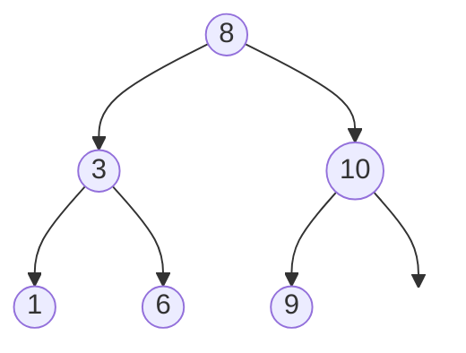
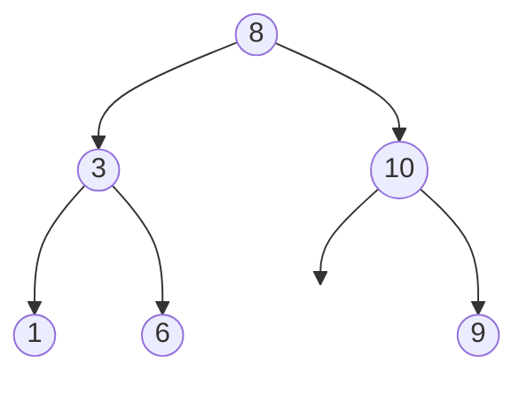

A [[complete binary tree]] is a [[binary tree]] where every level is full except the lowest level and is filled in from left to right.

## Complete example
This [[tree]] is complete because it's filled in from left to right.

## Incomplete example
It's incomplete because `10` has a right child of `9` but no left child. This means it's not filled in from left to right.
