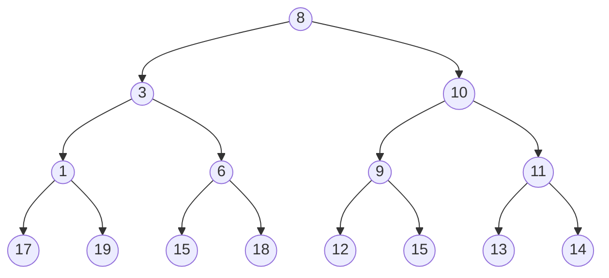
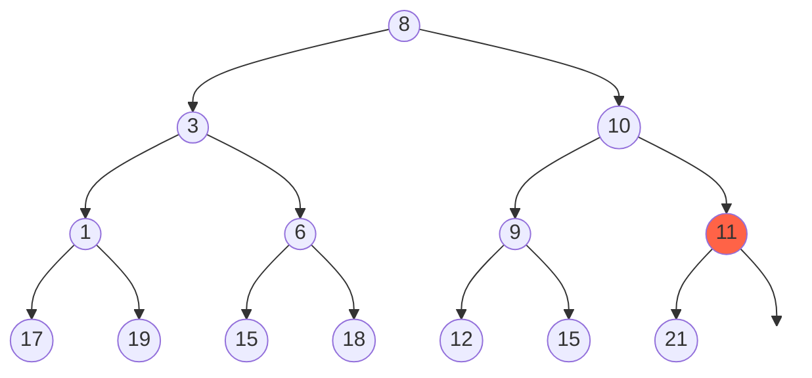
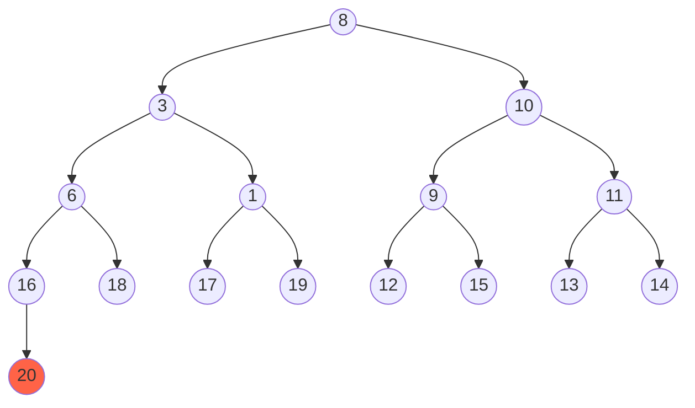

In a full [[binary tree]], every node either has two or no children. You can't have a node with a single child.  It's different than [[complete binary tree]] because the lower right must be filled out.

## Full Binary Tree Example
This is a full binary tree because every node as zero or two children.

## Non Full Binary Tree Example
This is not a full binary tree because it is missing an element in the lower right.

This one isn't full either because it has an extra element `20`.

