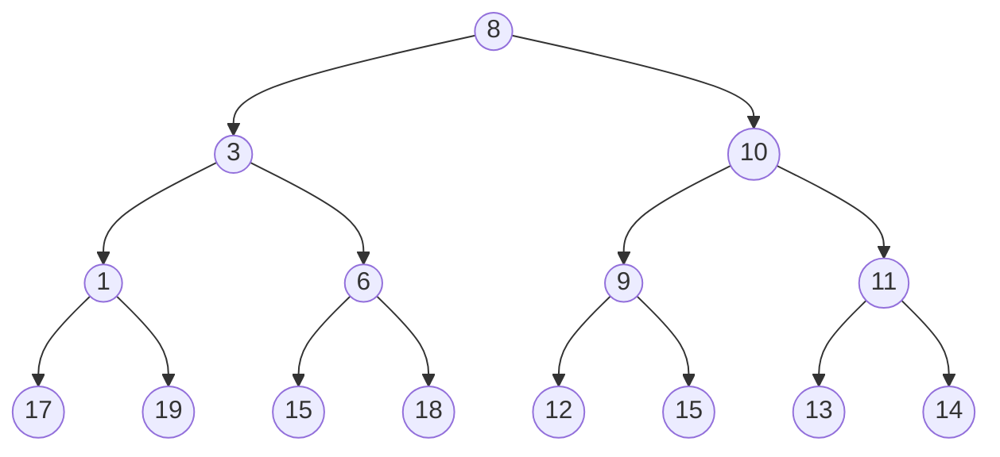
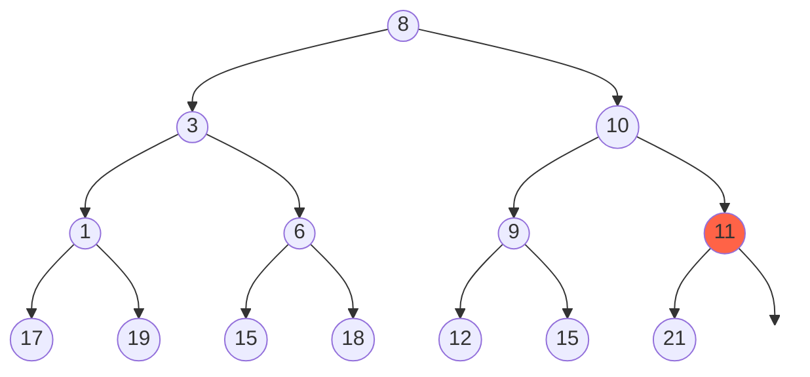
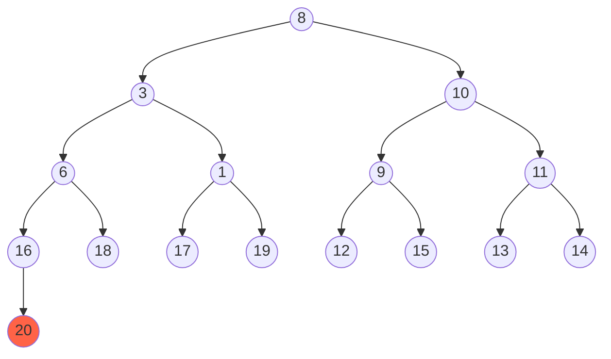

A perfect [[binary tree]] is a [[tree]] where all nodes have zero or two children and all leaf nodes are on the same level.

A perfect binary tree is both A [[full binary tree]] and [[complete binary tree]].

## Perfect Binary Tree Example
This is a perfect binary tree because every node as zero or two children and every leaf node is on the same level.

## Non Perfect Binary Tree Example
This is not a perfect binary tree because the leaf node `11` is not on the same level as others. It is both a [[perfect binary tree]] and a [[complete binary tree]] but not a perfect binary tree.

This one isn't perfect either because it has an extra element `20`.
