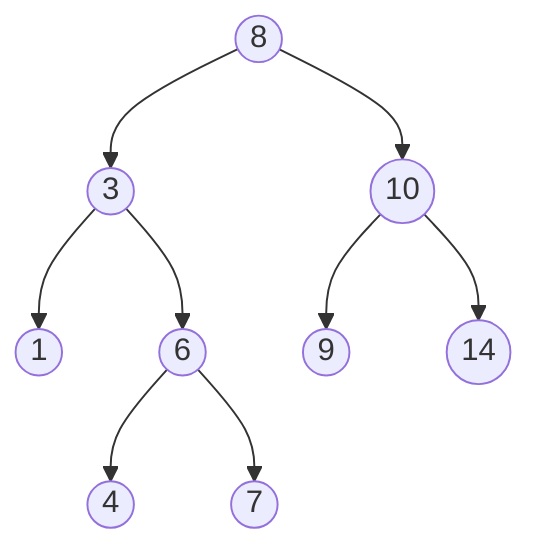

A guide to [[tree]] problems on [[leetcode]].

## What is a tree?
A [[tree]] is a set of connected nodes that does not form a "cycle". When following nodes on a [[tree]], you'll never visit a node more than once, unlike a graph.

## Types of Trees
### Binary Tree
A [[binary tree]] is a type of tree with two children.

### Binary Search Tree
A [[binary search tree]] is an ordered [[binary tree]] and the most important type to know.

A [[binary search tree]] is a special type of [[binary tree]] where all nodes in the left subtree are less than the root and all nodes in the right subtree are greater than the root.

It is important because this organization allows us to find a value in O(log(n)) time.

### Balanced Binary Tree
 A [[balanced binary tree]] is one in which no leaf nodes are ‘too far’ from the root. For example, one definition of balanced could require that all leaf nodes have a depth that differ by at most 1.

 Ideally our trees will be [[balanced binary tree]]s, otherwise in the extreme case they could turn into a linked list, and we wouldn't get the advantages of O(log(n)) tree find.

 

