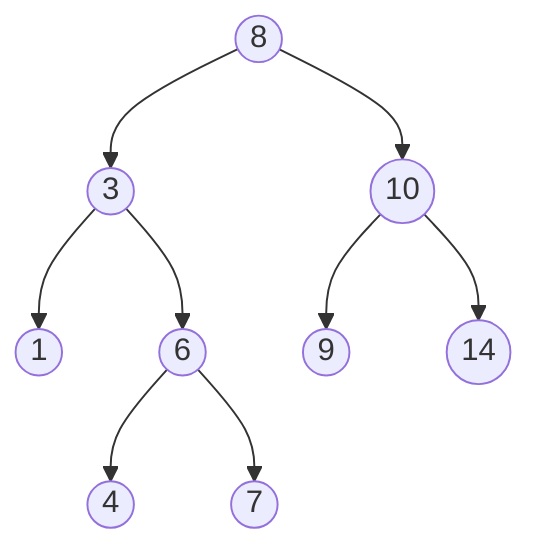

A tree is a set of connected nodes that does not form a cycle.

## Tree Diagram

## Tree Terminology
- **Root** is the topmost node of the tree
- **Edge** is the link between two nodes
- **Parent** is a node that has an edge to a child node
- **Child** is a node that has a parent node
- **Leaf** is a node that does not have a child node in the tree
- **Height** is the length of the longest path to a leaf
- **Depth** is the length of the path to its root

## Types of Trees
### Binary Tree
A [[binary tree]] is a type of tree with two children.

### Binary Search Tree
A [[binary search tree]] is a special type of ordered [[binary tree]] where all nodes in the left subtree are less than the root and all nodes in the right subtree are greater than the root.

It is important because this organization allows us to find a value in O(log(n)) time.

### Balanced Binary Tree
 A [[balanced binary tree]] is one in which no leaf nodes are ‘too far’ from the root. For example, one definition of balanced could require that all leaf nodes have a depth that differ by at most 1.

 Ideally our trees will be [[balanced binary tree]]s, otherwise in the extreme case they could turn into a linked list, and we wouldn't get the advantages of O(log(n)) tree find.

 ### Complete Binary Tree
A [[complete binary tree]] is a [[binary tree]] where every level is full except the lowest level and is filled in from left to right.

 ### Full Binary Tree
In a [[full binary tree]] every node either has two or no children. You can't have a node with a single child.

### Perfect Binary Tree

A [[perfect binary tree]] is where all nodes have zero or two children and all leaf nodes are on the same level.

