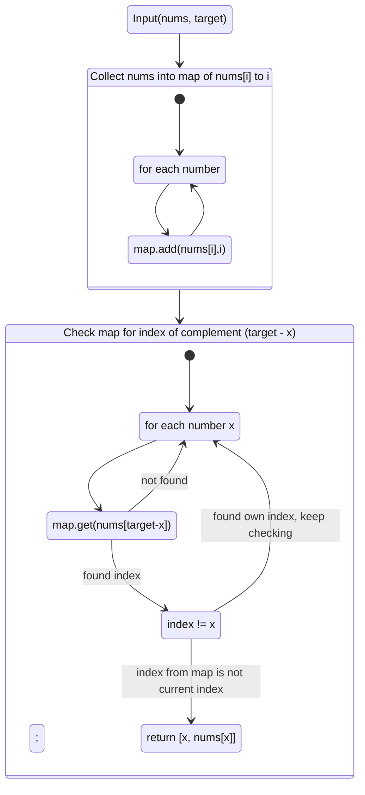

Given an array of integers nums and an integer target, return indices of the two numbers such that they add up to target. You may assume that each input would have exactly one solution, and you may not use the same element twice. You can return the answer in any order.

https://leetcode.com/problems/two-sum/

## Example 1:

``` js
Input: nums = [2,7,11,15], target = 9
Output: [0,1]
Explanation: Because nums[0] + nums[1] == 9, we return [0, 1].
```

## Example 2:
``` js
Input: nums = [3,2,4], target = 6
Output: [1,2]
```

## Example 3:
``` js
Input: nums = [3,3], target = 6
Output: [0,1]
```
 

## Constraints:
``` js
2 <= nums.length <= 104
-109 <= nums[i] <= 109
-109 <= target <= 109
Only one valid answer exists.
```

# Solution
``` js
var twoSum = function(nums, target) {
    let m = {};
for (let i = 0; i< nums.length; i++){
    m[nums[i]]=i;
}    
    for (let i = 0; i < nums.length; i++){
     let l = target - nums[i];
        if (m[l] && m[l] != i){
            return [i, m[l]]
        }
    }
}
```
# Flow Chart

